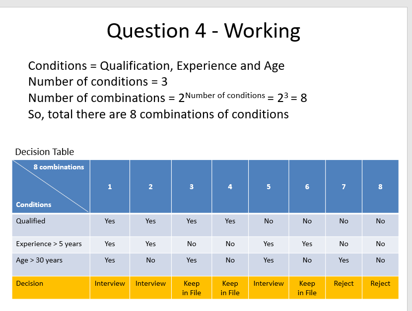
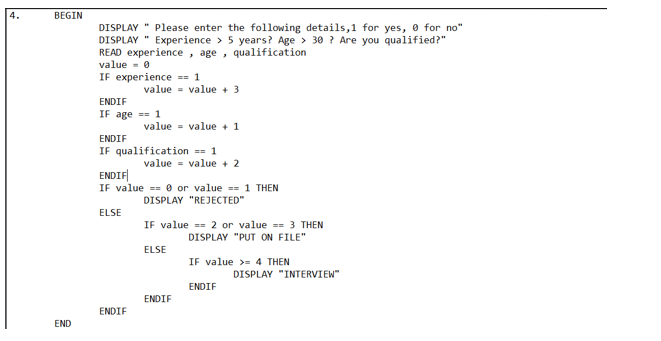
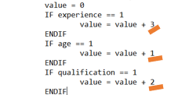
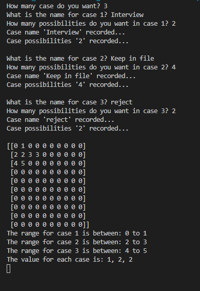
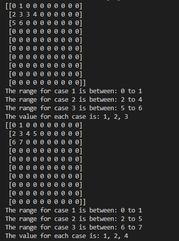
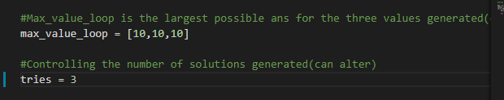

8/4/2021
A self thought problem

#Background and defining the problem

The teacher told us to use the psuedo code to write a logic that would differentiate between the person going to interview/keep in file/reject by different conditions. This would normally be solved by if-else, right? The teacher's answer was also to use If-else to solve the problem. But there is one person...

His answer was like this...

You multiply different values in different cases. At the end, if the values add up to between 0 and 1, you reject, if between 2 and 3, you keep in file, if greater than 4, you interview.

You can see here that he multiplies experience, age, and qualification by their respective values. Then I wondered how he got the numbers 1, 2 and 3, and if there was a pattern. So I wrote a program to find this 1,2,3.

I'll give you an example, you can see in, there is interview with 2 people, keep on file with 4 people and rejected with 2 people.

See that the value for each case? The solution to my program is 1,2,2; 1,2,3 and 1,2,4. That is, as long as it multiplies these numbers, they can get the results.

Then I wrote two global variables, max_value_loop to control the maximum value of that value. For example, if I have 10, 10, 10, the value of the answer could be 10, 10, 10. Then the tries, below, define how many solutions you want, so here tries = 3, which means that three solutions are generated. I also drew a diagram using matplotlib, which I've just learnt, and which is visible to anyone with matplotlib on their computer.

That's about it.

#IPO 
Input: 
How many cases do you split? -- count 
String of case num 1? -- case_name[0] 
...(repeat for count times) 
How many ppl do you want in each case? --case_count[0] 
...(repeat for count times) 
 
*should check the total of every element in case_count shouldnt exceed *(O didnt do this function :p, lazy) 
 
Process: 
1)Store inputs 
2)Do some loops 
3)sort 
4)split into n cases 
5)If condition(end of a array doesnt equals to start of a array) met, generate solution 
 
Output: 
With value value[0], value[1], value[2], 
There will be case_count[0] people in case_name[0] with range... 
